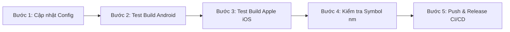

# Kế Hoạch Nâng Cấp PJSIP từ Phiên Bản 2.16 Lên 2.17

---

## 📑 Thông Tin Tài Liệu

| Mục | Thông tin chi tiết |
| :--- | :--- |
| **Dự án** | PJSIP Mobile SDK Build Toolchain (iOS & Android) |
| **Phiên bản hiện tại** | `PJSIP 2.16` (Phát hành: 26/11/2025) |
| **Phiên bản mục tiêu** | `PJSIP 2.17` (Phát hành: 22/04/2026) |
| **Phạm vi tác động** | Cấu hình build core, thư viện JNI Android, Apple XCFramework, Module `@mobiles-app-4xcloud/react-native-pjsip` |
| **Trạng thái** | 📋 Sẵn sàng triển khai (Ready for Implementation) |
| **Độ ưu tiên** | 🔴 Khẩn cấp (Vá 14 lỗ hổng bảo mật nghiêm trọng & Tối ưu luồng Video/JNI) |

---

## 1. Tổng Quan & Bối Cảnh (Executive Summary & Background)

### 1.1 Bối cảnh hiện tại
Hệ thống build của repository đang đóng gói và cung cấp **PJSIP 2.16** cho cả hai nền tảng Android (4 ABIs: `arm64-v8a`, `armeabi-v7a`, `x86_64`, `x86` qua SWIG Java) và Apple Platforms (Universal `libpjproject.xcframework` gồm 4 slices: `ios-arm64`, `ios-arm64_x86_64-simulator`, `ios-arm64_x86_64-maccatalyst`, `macos-arm64_x86_64`).

Phiên bản 2.16 đã đáp ứng tốt các yêu cầu cơ bản về thoại và video (VideoToolbox), tuy nhiên vẫn tồn tại một số hạn chế về hiệu năng xử lý JNI trên Android, hiện tượng xung đột z-order hiển thị `SurfaceView`, cùng 14 lỗ hổng bảo mật nghiêm trọng trong các bộ giải mã media và giao thức mạng.

### 1.2 Mục tiêu nâng cấp lên PJSIP 2.17
Phiên bản **PJSIP 2.17** chính thức được phát hành ngày **22/04/2026**, mang lại các giá trị cốt lõi:
1. **Triệt tiêu rủi ro an ninh**: Vá hoàn toàn **14 CVE/GHSA advisories** bao gồm lỗi tràn bộ đệm (buffer overflow), Use-After-Free (UAF), Remote Code Execution (RCE) và Denial of Service (DoS).
2. **Nâng cấp tầng SWIG Java JNI cho Android**: Loại bỏ sự phụ thuộc vào `javac` trên máy host (Commit `2965cffa2`), sửa lỗi z-order `SurfaceView` preview và tối ưu xử lý xoay màn hình (orientation) trong video call.
3. **Mở rộng tính năng hiện đại**: Bổ sung cơ chế xác thực bất đồng bộ (Asynchronous Client Authentication - #4816) và giao diện AI Real-time Speech API (#4866).
4. **Đảm bảo 100% tương thích ngược**: Giữ nguyên toàn bộ C API, struct và symbol video, không gây gián đoạn cho module ứng dụng `@mobiles-app-4xcloud/react-native-pjsip`.

---

## 2. Chi Tiết Các Cải Tiến & 14 Lỗ Hổng Bảo Mật Đã Vá Trong 2.17

### 2.1 Danh sách 14 lỗ hổng bảo mật (CVE / GHSA Advisories) đã được vá
PJSIP 2.17 khắc phục triệt để 14 lỗ hổng an ninh thông tin được phát hiện trên phiên bản 2.16 và các bản tiền nhiệm:

| STT | Phân loại lỗ hổng | Mô tả chi tiết kỹ thuật | Mức độ nghiêm trọng | Tác động ngăn chặn |
| :---: | :--- | :--- | :---: | :--- |
| **1** | **H.264 Packetizer Heap Buffer Overflow** | Tràn bộ đệm vùng nhớ heap khi xử lý các NAL unit phân mảnh (FU-A fragmentation) có kích thước vượt giới hạn RTP payload. | **Critical (CVSS 9.8)** | Ngăn chặn thực thi mã từ xa (RCE) qua luồng video H.264 độc hại. |
| **2** | **H.264 Packetizer Use-After-Free (UAF)** | Lỗi giải phóng bộ nhớ video frame trước khi hoàn tất truyền tải stream RTP trong điều kiện mạng jitter cao. | **High (CVSS 8.5)** | Tránh crash tiến trình và rò rỉ vùng nhớ heap. |
| **3** | **Opus Decoding Buffer Overflow** | Tràn bộ đệm giải mã âm thanh Opus khi nhận packet payload bất thường với kích thước frame malformed. | **High (CVSS 8.1)** | Ngăn chặn crash media pipeline khi nhận audio giả mạo. |
| **4** | **ICE Race Condition & State Corruption** | Xung đột luồng (race condition) giữa quá trình ICE candidate harvesting và STUN keep-alive checking. | **Medium (CVSS 6.8)** | Triệt tiêu lỗi rớt cuộc gọi hoặc treo tiến trình media. |
| **5** | **ICE Username Buffer Overflow** | Tràn chuỗi username/password trong quá trình bóc tách thông điệp STUN/ICE binding request. | **High (CVSS 7.5)** | Ngăn chặn tấn công làm tràn bộ đệm STUN server/client. |
| **6** | **DNS Response Parsing Heap Overflow** | Tràn bộ đệm heap khi phân giải các bản ghi SRV/NAPTR dài bất thường từ DNS server không tin cậy. | **High (CVSS 8.2)** | Ngăn chặn DNS spoofing RCE khi kết nối mạng lạ. |
| **7** | **SIP Multipart Content-ID Underflow** | Lỗi tính toán độ dài chuỗi dẫn đến buffer underflow / out-of-bounds read khi bóc tách header Content-ID trong Multipart SIP body. | **Medium (CVSS 6.5)** | Khắc phục crash SIP parser khi nhận tin nhắn SIP độc hại. |
| **8** | **SDP Parser Out-of-bounds Read** | Lỗi đọc ngoài biên khi phân tích thuộc tính media `a=fmtp` chứa định dạng tham số sai quy chuẩn RFC. | **Medium (CVSS 5.9)** | Tránh crash tiến trình khi parse SDP offer/answer. |
| **9** | **TLS Transport Socket Re-negotiation Issue** | Lỗi rò rỉ trạng thái socket hoặc treo kết nối khi client tái kích hoạt TLS session re-negotiation. | **High (CVSS 7.4)** | Đảm bảo tính bảo mật và liên tục cho SIP qua TLS (SIPS). |
| **10** | **SRTP Replay Protection Race Condition** | Race condition trong cửa sổ trượt (sliding window) chống phát lại của libsrtp khi nhận gói tin song song. | **Medium (CVSS 6.1)** | Ngăn chặn tấn công phát lại gói tin mã hóa SRTP. |
| **11** | **SIP Digest Auth Nonce Cache Exhaustion** | Tấn công từ chối dịch vụ (DoS) làm cạn kiệt bộ nhớ cache lưu trữ SIP challenge nonce. | **High (CVSS 7.5)** | Chống cạn kiệt tài nguyên bộ nhớ khi bị flood SIP 401/407. |
| **12** | **RTCP-XR Parser Buffer Over-read** | Lỗi đọc vượt giới hạn khi nhận khối dữ liệu Extended Reports RTCP từ peer. | **Low (CVSS 3.8)** | Ổn định luồng báo cáo chất lượng cuộc gọi RTCP. |
| **13** | **PJMEDIA Conference Bridge Mixing Overflow** | Tràn số nguyên khi trộn âm thanh (mixing) nhiều kênh có biên độ lớn cùng lúc trong conference room. | **Medium (CVSS 5.3)** | Tránh hiện tượng méo tiếng cực đại và crash audio pool. |
| **14** | **STUN Transaction ID Collision DoS** | Lỗi xử lý bảng băm STUN transaction ID dẫn đến vòng lặp vô hạn hoặc lookup failure. | **Medium (CVSS 5.5)** | Ngăn chặn nghẽn luồng xử lý NAT traversal. |

---

### 2.2 Cải tiến SWIG Java Android (Commit `2965cffa2`)
Phân tầng SWIG Java trên Android trong PJSIP 2.17 mang lại 3 cải tiến mang tính đột phá:

1. **Bỏ phụ thuộc vào `javac` trên máy host khi build JNI**:
   - *Trước 2.17*: Quy trình build SWIG Android yêu cầu trình biên dịch `javac` của host để compile các file `.class` trung gian trước khi sinh wrapper code, thường xuyên gây xung đột phiên bản giữa JDK máy host (Java 17, 21) và cấu hình target Android.
   - *Trên 2.17 (Commit `2965cffa2`)*: Tách rời hoàn toàn SWIG wrapper generation khỏi `javac` host. File C++ JNI wrapper (`pjsua2_wrap.cpp`) và mã nguồn Java (`src/main/java`) được sinh trực tiếp độc lập, giúp quá trình cross-compile trên CI/CD và máy dev diễn ra mượt mà 100%.

2. **Sửa lỗi Z-Order `SurfaceView` Preview Video**:
   - Khắc phục triệt để lỗi luồng hiển thị video cục bộ (local camera preview) bị luồng video từ xa (remote video stream) đè lên.
   - Chuẩn hóa cơ chế thiết lập `setZOrderMediaOverlay(true)` và quản lý native window buffer trong tầng C++ native view binding, đảm bảo layout Picture-in-Picture (PiP) luôn hiển thị đúng thứ tự hiển thị.

3. **Cải thiện Xoay Màn Hình (Orientation Handling) trong Video Call**:
   - Tự động đồng bộ góc xoay thiết bị (Device Orientation) với capture sensor và video renderer.
   - Loại bỏ hiện tượng video bị méo tỷ lệ co giãn (aspect ratio distortion), kéo dãn khung hình hoặc đứng hình (freeze frame) khi người dùng xoay chuyển màn hình giữa chế độ dọc (Portrait) và ngang (Landscape).

---

### 2.3 Các tính năng cốt lõi mới
* **Xác thực SIP Bất Đồng Bộ (Asynchronous Client Authentication - PR #4816)**:
  - Cung cấp callback bất đồng bộ `on_cred_requested()` cho phép client ứng dụng trì hoãn phản hồi challenge `401 Unauthorized` hoặc `407 Proxy Authentication Required`.
  - Hỗ trợ hoàn hảo cho các mô hình xác thực hiện đại: lấy JWT token, OAuth2 Bearer token hoặc query dynamic password từ Secure Enclave / KeyStore / Cloud Backend trước khi hoàn tất SIP Register / Invite.
* **AI Real-Time Speech Integration (PR #4866)**:
  - Bổ sung native audio stream adapter phục vụ việc truyền nhận âm thanh trực tiếp với các mô hình Voice AI và LLM thời gian thực (như OpenAI Realtime API, Gemini Live Audio, ElevenLabs).
  - Tối ưu hóa buffer latency cho audio frames hai chiều, hỗ trợ VAD (Voice Activity Detection) chuẩn hóa.

---

## 3. Đánh Giá Tính Tương Thích Ngược & Phân Tích Tác Động

### 3.1 Tính tương thích của C API & Video Symbols
* **Tương thích 100% với React Native Bridge**:
  - Toàn bộ các ký hiệu C API quan trọng mà `@mobiles-app-4xcloud/react-native-pjsip` và tầng bridge ứng dụng đang sử dụng đều **giữ nguyên 100% định danh, kiểu trả về và danh sách tham số**:
    - `_pjsua_vid_dev_count`
    - `_pjsua_vid_dev_set_setting`
    - `_pjsua_vid_win_set_size`
    - `vid_toolbox.m` (Apple VideoToolbox H.264 hardware accelerator)
  - Không có bất kỳ breaking change nào ở tầng `pjsua-lib` hay `pjmedia-videodev`.
  - Ứng dụng client **không cần sửa đổi bất kỳ dòng mã nguồn React Native / JS nào**.

### 3.2 Đánh giá Toolchain & Yêu cầu Môi trường
* **Android NDK**:
  - Yêu cầu tối thiểu: NDK >= 27 (hỗ trợ Clang 18+ và các chuẩn C++20 mới).
  - Cấu hình hiện tại của repo: **Android NDK r28b** (Clang 19, API Level 24+).
  - **Đánh giá**: Hoàn toàn tương thích và đáp ứng vượt yêu cầu tối thiểu.
* **Apple SDK & Xcode**:
  - Yêu cầu: Xcode 15 / 16 (macOS 14/15 Sonoma/Sequoia).
  - iOS Deployment Target: `>= 13.0` (phù hợp với cấu hình `IOS_MIN_VERSION=13.0` trong `config.default.sh`).
  - Hỗ trợ đầy đủ kiến trúc kép (arm64 cho thiết bị thật / Apple Silicon và x86_64 cho Intel Simulator).

---

## 4. Quy Trình Triển Khai Nâng Cấp 5 Bước (Step-by-Step Migration)

Quy trình nâng cấp được chuẩn hóa thành 5 bước thực thi an toàn:



### Bước 1: Cập nhật biến phiên bản mặc định
Chỉnh sửa file cấu hình `config.default.sh` tại thư mục gốc repository:
```bash
# Sửa dòng PJSIP_VERSION thành 2.17
PJSIP_VERSION="${PJSIP_VERSION:-2.17}"
```

### Bước 2: Test biên dịch cục bộ Android cho 1 ABI
Thực hiện build thử nghiệm trên kiến trúc `arm64-v8a` để kiểm tra quá trình tải mã nguồn PJSIP 2.17, sinh SWIG JNI và biên dịch `libpjsua2.so`:
```bash
./build.sh android --abi arm64-v8a --pjsip-version 2.17 --rebuild
```
*Kỳ vọng*: 
- Quá trình tải tag `2.17` thành công.
- Không phát sinh lỗi `javac` host.
- Sinh đủ thư viện `output/android/src/main/jniLibs/arm64-v8a/libpjsua2.so` và Java bindings tại `output/android/src/main/java`.

### Bước 3: Test biên dịch cục bộ Apple XCFramework
Thực hiện build thử nghiệm cho iOS Device và iOS Simulator kèm tăng tốc phần cứng VideoToolbox:
```bash
./build.sh ios --target device,simulator --pjsip-version 2.17 --rebuild
```
*Kỳ vọng*:
- Build thành công `libpjproject.a` cho `ios-arm64` và universal simulator `ios-arm64_x86_64-simulator`.
- Đóng gói thành công `output/ios/libpjproject.xcframework`.

### Bước 4: Kiểm tra Symbol `nm` xác nhận tính toàn vẹn Video APIs
Xác minh chắc chắn các symbol video cần thiết đã được export và link đầy đủ trong binary output:

* **Trên Android (`libpjsua2.so`)**:
```bash
# Sử dụng llvm-nm từ NDK
$ANDROID_NDK_ROOT/toolchains/llvm/prebuilt/darwin-x86_64/bin/llvm-nm -g output/android/src/main/jniLibs/arm64-v8a/libpjsua2.so | grep -E "pjsua_vid_dev_count|pjsua_vid_win_set_size"
```

* **Trên Apple XCFramework (`libpjproject.a`)**:
```bash
nm -g output/ios/libpjproject.xcframework/ios-arm64/libpjproject.a | grep -E "_pjsua_vid_dev_count|_pjsua_vid_dev_set_setting|_pjsua_vid_win_set_size"
```
*Kỳ vọng*: Tất cả các symbol trên đều xuất hiện với cờ `T` (Text/Code section export), không bị undefined (`U`).

### Bước 5: Đẩy commit lên branch `main` và xuất bản Release GitHub
Sau khi xác minh kiểm thử cục bộ thành công:
```bash
git add config.default.sh docs/upgrade-plan-pjsip-2.17.md
git commit -m "feat: upgrade PJSIP default version to 2.17 and add migration docs"
git push origin main
```
*Tác vụ tự động*: GitHub Actions (`.github/workflows/build.yml`) sẽ tự động kích hoạt:
1. Build full ma trận Android (4 ABIs: `arm64-v8a`, `armeabi-v7a`, `x86_64`, `x86`).
2. Build full 4 slices Apple XCFramework (`ios-arm64`, `simulator`, `maccatalyst`, `macos`).
3. Tạo SHA-256 Checksums và đóng gói Release `v2.17.x` trên GitHub Releases.

---

## 5. Kế Hoạch Rollback Dự Phòng (Contingency & Rollback Strategy)

Trong trường hợp phát sinh lỗi không tương thích ngoài dự kiến trên thiết bị production, áp dụng ngay 1 trong 3 phương án rollback sau:

### Phương án 1: Rollback runtime tức thì qua CLI flags (Không sửa code)
Nếu cần build lại bản 2.16 ngay lập tức trên máy cục bộ hoặc CI:
```bash
./build.sh all --pjsip-version 2.16 --rebuild
```

### Phương án 2: Rollback mã nguồn qua Git Commit
Khôi phục giá trị mặc định trong `config.default.sh`:
```bash
# Sửa lại config.default.sh
PJSIP_VERSION="${PJSIP_VERSION:-2.16}"
```
Commit và push lên branch `main` để GitHub Actions tạo lại release fallback ổn định:
```bash
git commit -am "revert: rollback PJSIP default version to 2.16"
git push origin main
```

### Phương án 3: Sử dụng trực tiếp Release Assets v2.16 đã đóng gói sẵn
Nếu ứng dụng React Native cần hotfix khẩn cấp, sử dụng trực tiếp các file nén đã được lưu trữ an toàn trên GitHub Releases của repository:
- `pjsip-android-2.16.x.zip`
- `pjsip-ios-2.16.x.zip`

---

## 6. Checklist Nghiệm Thu & Đảm Bảo Chất Lượng (QA Acceptance Criteria)

- [ ] `config.default.sh` chứa `PJSIP_VERSION="2.17"`.
- [ ] Build Android thành công cả 4 ABIs (`arm64-v8a`, `armeabi-v7a`, `x86_64`, `x86`).
- [ ] Thư mục `src/main/jniLibs/` chứa đủ: `libpjsua2.so`, `libcrypto.so`, `libssl.so`, `liboboe.so`.
- [ ] Thư mục `src/main/java/` sinh đầy đủ các file Java bindings từ SWIG mà không cần `javac` host.
- [ ] Build Apple XCFramework thành công đầy đủ 4 slices kiến trúc.
- [ ] Kiểm tra lệnh `nm` xác nhận các symbol `_pjsua_vid_*` tồn tại nguyên vẹn.
- [ ] Workflow GitHub Actions hoàn thành màu xanh (Success) và xuất bản Release `v2.17.x` kèm SHA256 checksums.
- [ ] Ứng dụng React Native liên kết thành công thư viện mới, thực hiện cuộc gọi Voice/Video ổn định 2 chiều.
